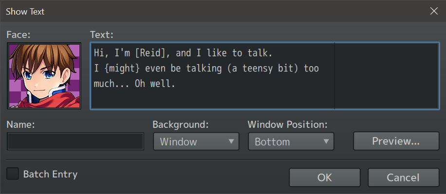

# N_AutoTextReplace
Automatically replaces some text with some other text.

| Show Text...          | Rendered output        |
| --------------------- | ---------------------- |
|  |  |

By default, this plugin only adds pause to punctuation:
- `,` -> `,\.`: Adds a 1/4 second pause to commas.
- `.` -> `.\|`: Adds a 1 second pause to dots.
- `!` -> `!\|`: Adds a 1 second pause to exclamation marks.
- `?` -> `?\|`: Adds a 1 second pause to question marks.

This is customizable and can be extended to also automatically change text color within brackets (see screenshots above) and more.

| Project           | Latest release      |
| ----------------- | ------------------- |
| N_AutoTextReplace | [Download][release] |

[All RPG Maker plugins by Nolonar][hub]

## Compatibility
Tested and confirmed working:
- RPG Maker MV
- RPG Maker MZ

## Terms of Use
According to [LICENSE](LICENSE).

  [hub]: https://github.com/Nolonar/RM_Plugins
  [release]: https://github.com/Nolonar/RM_Plugins-AutoTextReplace/releases/latest/download/N_AutoTextReplace.js
